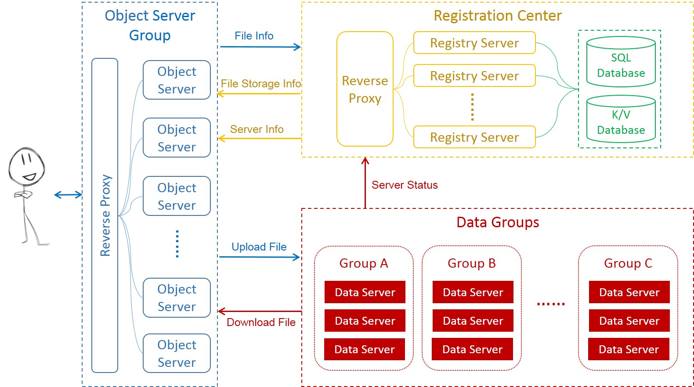

# Arkor - Object Storage Service

## Introduction 

Arkor is an object storage service application with high availability and high performance. It is best suited for storing blobs such as container/VM images, software packages, log files, videos, photos and so on. As a distributed system, Arkor can be easily scaled out by simply adding more servers horizontally or embeded into other application developed by Golang. 

## Features

* Compatible with [Amazon S3](http://aws.amazon.com/s3/)
* Compatible with [Git-LFS (Git Large File Storage)](https://git-lfs.github.com/)
* High Performance
	* Efficient data storage server written in C language
	* Split large file into small pieces and upload/download concurrently
	* Object server upload/download file directly to/from data server
* High Availability&Scalability
	* Stateless Object&Registry server
	* 3 replications data storage 
	* Dynamic scaled out

## Quick Start
	TODO

## Architecture

Arkor include three modules: Object Server Group, Registration Center and Data Groups:

### Object Server Group

`Object Server Group` is a statelless proxy server group that designed to provide REST API for user to PUT/GET files and manage the file/metadata. When a user wants to PUT/GET a file, it retrives data server info and file storage info(e.g fileID) from  `Registry Center` and execute the PUT/GET operations directly with related `Data Server`.

### Registry Center

`Registry Center` maintains the server and file information. It has three main functions: 
  - recive, store and send the basic information and status of all `Data Servers`. 
	- recive, store and send the metadata of files storaged in arkor. 
	- allocate fileID to `Object Server Group` when user wants to upload files.

### Data Group

`Data Group` contains multiple (usually three) highly optimized storage engine for performance and space efficiency called `Data Server`. It appends single small file to large file to keep the IO overhead at a low level. When user starts a PUT process, the `Object Server Group` will PUT the file to all `Data Servers` in the group. But in the GET process, the `Object Server Group` retrive file from any of it.  

## Developers Guide

See the document of [APIs](docs/specs/API.md), [FileID spec](docs/specs/FileID.md), [Internal APIs](docs/specs/Internal.md)

## License
The code is licensed under the MIT licence

